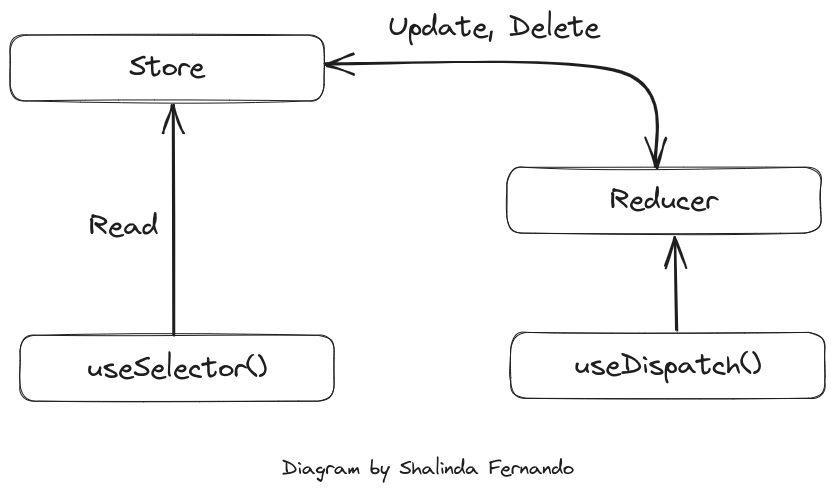

# Redux ToolKIT Todo APP

This is a project is a simple todo application. The main intension of the application is to work with a state management library called Redux ToolKIT.

# Arch

The core components of Redux ToolKIT and how they interact with eachother.

# Steps

1. Create a store: Configure the store.
2. Add reducers: Reducers are added in the features folder according to the feature we're storing the data of.
3. Set the Provider Context in the entry point of the react app.
4. Use the `useDispatch()` hook to call the reducer actions.
5. Use the `useSelector()` hook to get values from store.
